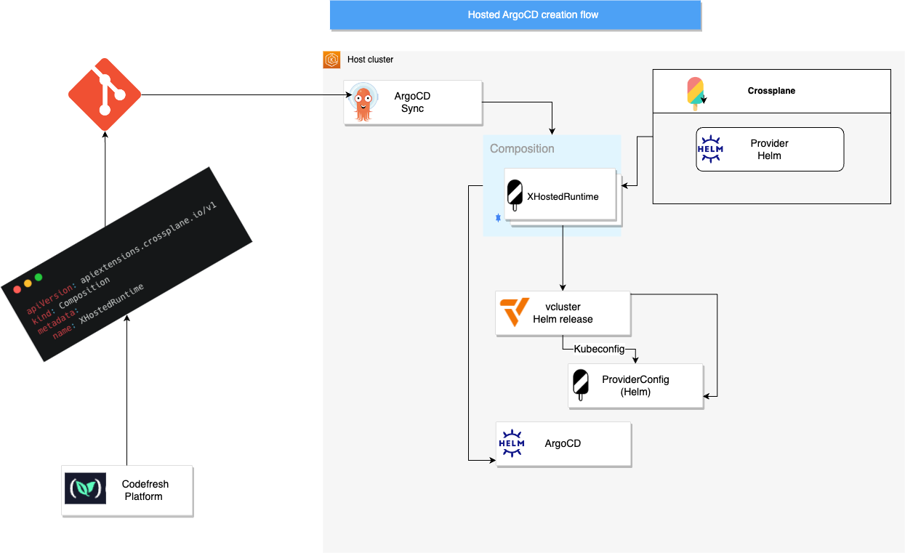

## Using Crossplane to deploy ArgoCD on vcluster

### Objective: 
How We Can Securely Scale Multi-Tenancy with VCluster, Crossplane, and Argo CD.

### Explanation: (https://github.com/codefresh-contrib/demo-crossplane-vcluster)
What do you do when RBAC with namespaces aren’t enough to meet your multi-tenancy needs? Namespaces are easy to implement but they generally do not provide the level of isolation that is needed when working with external users. Instead of running multiple clusters, which are complex to manage, hard to scale and often costly, we turned to vCluster. vCluster is an open source project that allows you to create virtual clusters in any Kubernetes cluster. Virtual clusters enjoy higher isolation than simple namespaces and can also be used for cluster level resources like CRDs without any versioning conflicts. Using virtual clusters in the Codefresh’s hosted GitOps platform that is powered by thousands of Argo instances we can enable high isolation between tenants while lowering the cost of application multi-tenancy. For most companies, multi-tenancy means supporting multiple teams within an organization, or perhaps a partner. For us, multi-tenancy means providing access to the general public. We needed to go deeper than RBAC, namespaces, and auditing. In this end-user demo, we’ll see how we can leveraged vCluster, Crossplane, and Argo CD to approach multi-tenancy, scale, and security in a totally GitOps fashio and see how vCluster scale.

### Architecture:



### Solution Architecture:


### VCluster Architecture:


### [Presentation](./multi-tenancy-vcluster-crossplane-argocd-kubecon.pdf "Presentation")

Run your own [k3d](https://k3d.io/) cluster with [Crossplane](https://www.crossplane.io/) and deploy [ArgoCD](https://argoproj.github.io/cd/) instances onto [vclusters](https://www.vcluster.com/)

---
### Dependencies

- [Docker](https://docs.docker.com/engine/install/ubuntu/)
- [k3d](https://k3d.io/#installation)
- [kubectl](https://kubernetes.io/docs/tasks/tools/#kubectl)
- [Helm](https://helm.sh/docs/intro/install/)

---
## What's in this repository?
1. [Initialization script](scripts/init-k3d-demo-env.sh) - deploys k3d cluster and installs ArgoCD onto it. It also applies the [argocd-applications](argocd-applications) to this cluster.
2. [crossplane-resources](crossplane-resources) - Contains the providers required to deploy our virtualargocd composite resource, along with the [definition](crossplane-resources/xvirtualargocd/definition.yaml) and the [composition](crossplane-resources/xvirtualargocd/composition.yaml)
3. [virtualargocds](virtualargocds) - contains the composite resource claims. Here we will define all instances of the composition to be created.
4. [argocd-applications](argocd-applications) - contains ArgoCD applications so that ArgoCD syncs it all to the cluster. One of the ArgoCD appplications deploys crossplane itself to the cluster.
---
## How to run the demo?
1. Fork the repo
2. Replace repository URL in [crossplane-resources.yaml](argocd-applications/crosspalne-resources.yaml) and in [virtual-argocds.yaml](argocd-applications/virtual-argocds.yaml). 
3. Execute [initializtion script](scripts/init-k3d-demo-env.sh).
4. Once all ArgoCD applications are synced, uncomment [customer2.yaml](virtualargocds/customer2.yaml), see that a namespace is created, with vcluster and ArgoCD deployed onto it.


### Access ArgoCD UI: 

```
$ kubectl get ing -n argocd
NAME             CLASS   HOSTS                        ADDRESS      PORTS   AGE
argocd-ingress   nginx   argocd.192.168.1.99.nip.io   172.23.0.2   80      55m

```

Browser (ArgoCD UI): http://argocd.192.168.1.99.nip.io:8888

### Screenshots:


Note: After uncomment [customer2.yaml](virtualargocds/customer2.yaml)


```
$ kubectl get po --all-namespaces
NAMESPACE           NAME                                                     READY   STATUS    RESTARTS   AGE
kube-system         coredns-59b4f5bbd5-jw8b7                                 1/1     Running   0          60m
kube-system         local-path-provisioner-76d776f6f9-s4zcj                  1/1     Running   0          60m
kube-system         metrics-server-7b67f64457-nw8hd                          1/1     Running   0          60m
kube-system         svclb-ingress-nginx-controller-8a713601-2m6sw            2/2     Running   0          58m
ingress-nginx       ingress-nginx-controller-5ff6bb675f-9x5pl                1/1     Running   0          58m
argocd              argocd-redis-7c9f8b6555-gjhq8                            1/1     Running   0          56m
argocd              argocd-notifications-controller-7c8b57c4f8-jk7ln         1/1     Running   0          56m
argocd              argocd-applicationset-controller-797b697bdd-cpwd2        1/1     Running   0          56m
argocd              argocd-repo-server-657cdc694-pddr4                       1/1     Running   0          56m
argocd              argocd-server-65bc7fd767-29gfz                           1/1     Running   0          56m
argocd              argocd-application-controller-0                          1/1     Running   0          56m
crossplane-system   crossplane-645745b895-2wgw4                              1/1     Running   0          54m
crossplane-system   crossplane-rbac-manager-67b9754dc7-xjr8v                 1/1     Running   0          54m
crossplane-system   provider-kubernetes-05f3a0c313f0-5cf8c89bbc-mw6dq        1/1     Running   0          53m
crossplane-system   crossplane-provider-helm-59fc94cd939e-586986678d-zw248   1/1     Running   0          53m

```

REF: 

- Demo video: https://www.youtube.com/watch?v=hFiHU6W4_z0
- Demo repo: https://github.com/codefresh-contrib/demo-crossplane-vcluster
- https://github.com/loft-sh/vcluster
- https://github.com/janwillies/virtual-k8s-argocd
- https://github.com/iam-veeramalla/k8s-crossplane-argocd
- etc.

Note: Note: Argo CLI, helm upgrade ingress-nginx ingress-nginx/ingress-nginx -n ingress-nginx --create-namespace --set controller.publishService.enabled=true --set controller.extraArgs.enable-ssl-passthrough=true

